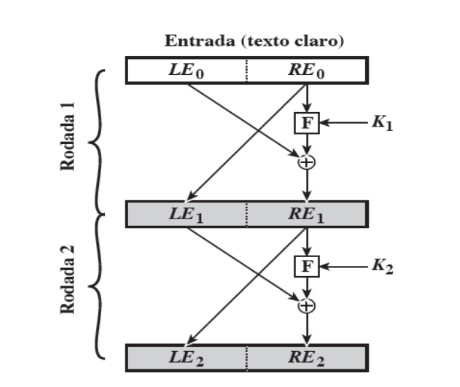

🛡️ Simulação de Cifra Feistel em Python

    Este projeto é uma simulação de uma cifra do tipo Feistel. Ele recebe um texto hexadecimal como entrada, divide em blocos de 64 bits e aplica 16 rodadas de processamento usando operações de XOR e shift de chave, simulando o funcionamento de algoritmos de criptografia em blocos.

📚 Funcionalidades

    Conversão de hexadecimal para binário.
    Divisão do texto em blocos de 64 bits.
    Processamento em 16 rodadas com chave de 64 bits.
    Operações de XOR entre blocos e chave.
    Troca de blocos (rede de Feistel simples).
    Resultado final em binário e hexadecimal.

⚙️ Como executar
    Abra o terminal na pasta do projeto.
    Execute o script com:
        python cifra.py

    Quando solicitado, insira um texto hexadecimal:
    Digite um texto em hexadecimal: 0123456789ABCDEF
    Saída esperada: 6B5AB032706A1DDA

    para decriptar siga os mesmos passos só que executando 
        python decriptação.py

    Digite o texto cifrado em hexadecimal: 6B5AB032706A1DDA
    Saída esperada: 0123456789ABCDEF

